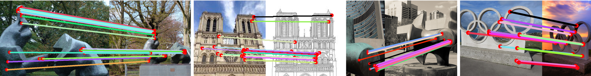

# Co-Attention for Conditioned Image Matching

This repository contains the official implementation of: 

**[Co-Attention for Conditioned Image Matching](https://arxiv.org/abs/2007.08480)**



We provide some training scripts and demos demonstrating our model accompanying the paper.

# Installation
To install the required libraries, we used the following non standard libraries (all libraries can be viewed in `environment.yml`).

- pytorch 1.4
- torchvision 0.5
- tensorboardx 2.0
- pyquaternion 0.9.5
- modified version of https://github.com/qubvel/segmentation_models.pytorch 0.1.0

Installation using conda:
```
# Install main environment
conda-env create -f environment.yml
# Activate environment
conda activate d2d_env
# Install custom segmentation library
pip install git+https://github.com/hyenal/segmentation_models.pytorch.git
# Install GPU version
pip install torch==1.4.0+cu92 torchvision==0.5.0+cu92 -f https://download.pytorch.org/whl/torch_stable.html
```
Note that the last part uses CUDA 9.2, to use another version please visit https://download.pytorch.org/whl/torch_stable.html. 

The pretrained models are available at the anonymised google drive [link](https://drive.google.com/drive/folders/1wfjvvD4bU6e-75aBM6cn411-LOPcGG13?usp=sharing) which includes the [Eff-Net](https://drive.google.com/file/d/1d4XykYKY9Cgpvuvs9lNWZkTUWL6o83Jc/view?usp=sharing), [ResNet50](https://drive.google.com/file/d/1V4usjvbv8DbPQhIWfGJINgmqE1b2Mzkc/view?usp=sharing), and [Stylisation](https://drive.google.com/file/d/1gghQeBJB_eP-dRkq7tvOu__TWizA9SYL/view?usp=sharing).
The pretrained models should be downloaded into the `./pretrainedmodels` folder.

Once this has all been done then you can try the quickstart, or download data and either train or evaluate a model.

# Quickstart
The [demo notebook](./demo/visualisation.ipynb) can be used to see a minimal working example of our model.

# Dataset
To use this code, you need to download data from multiple places:

- [MegaDepth](https://research.cs.cornell.edu/megadepth/)
- [HPatches](https://github.com/hpatches/hpatches-dataset/blob/master/README.md)
- [Aachen](https://www.visuallocalization.net/)
- [Sculpture Dataset](https://www.robots.ox.ac.uk/~vgg/data/sculptures/). Note that here you only need sculptures with ids 1060-1068 (these are the Henry Moore sculptures we evaluated on). Also you need to extract the high resolution images. These were conveniently provided by the author. We will provide these high resolution images upon agreement with the original author.
- [Large Sculpture Dataset](./evaluation/evaluate_sfm/local-feature-evaluation/INSTRUCTIONS.md). In particular we use three of these sculptures: Madrid Metropolis, Gendarmenmarkt, Tower of London. 


# Training
We provide a simple train launch file in [run.sh](./run.sh). The following command will launch one training on a single GPU:
```
./run.sh /path/to/MegaDepth/
```
Other configs are available in `run.sh`

# Citing
If you use this work for your research please consider citing us:
```
@inproceedings{Wiles21,
  author={Olivia Wiles and Sebastien Ehrhardt and Andrew Zisserman},
  title={Co-Attention for Conditioned Image Matching},
  year={2021},
  conference={CVPR}
}
```